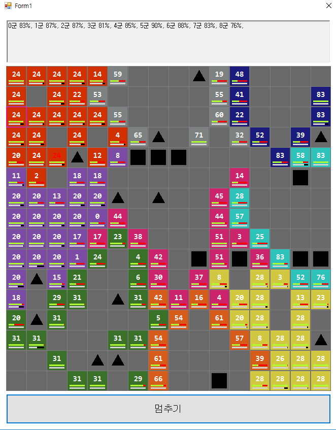

# Battle Simulator

전투 시뮬레이터 입니다

## 게임 규칙

- 맵에서 전투가 펼쳐지며 기본 크기는 16 * 16 입니다.

- 맵에는 두 종류의 특수지형이 있고 각각  통과하지 못 하는 산과 
유닛의 조직력이 낮아지는 강이 입니다.

- 각 유닛은 세력의 크기와 사기, 조직력을 가지고 있습니다.

- 사기가 0으로 떨어지면 전장에서 이탈을 시도하고 주변 아군의 사기를 하락시킵니다.

- 사기가 0으로 떨어졌으나 후퇴할 곳을 찾지 못 하면 사기과 곧 전부 회복됩니다.

- 조직력이 낮으면 행동 우선순위가 낮아집니다.

- 위 텍스트는 각 군대의 전쟁 지지도를 의미하며 0이되면 더 이상의 군대를 투입하지 않습니다.

- 전쟁 지지도는 군대의 전장이탈, 군대의 전사에 따라 달라집니다.